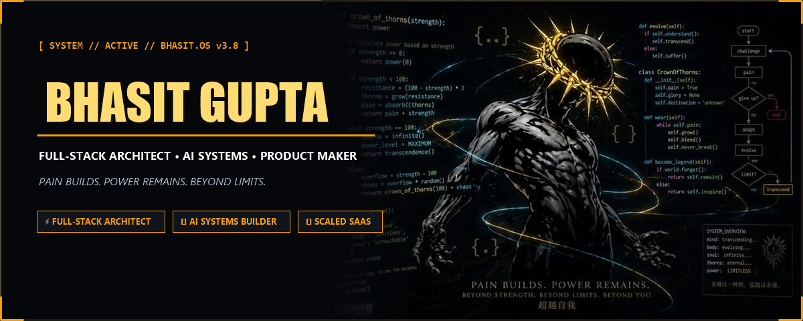
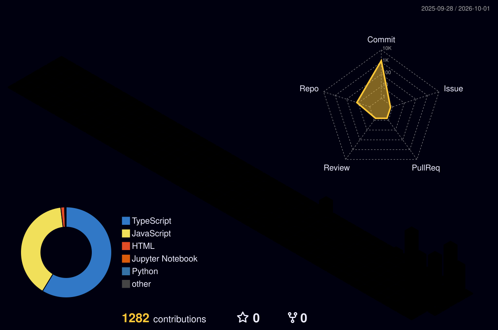
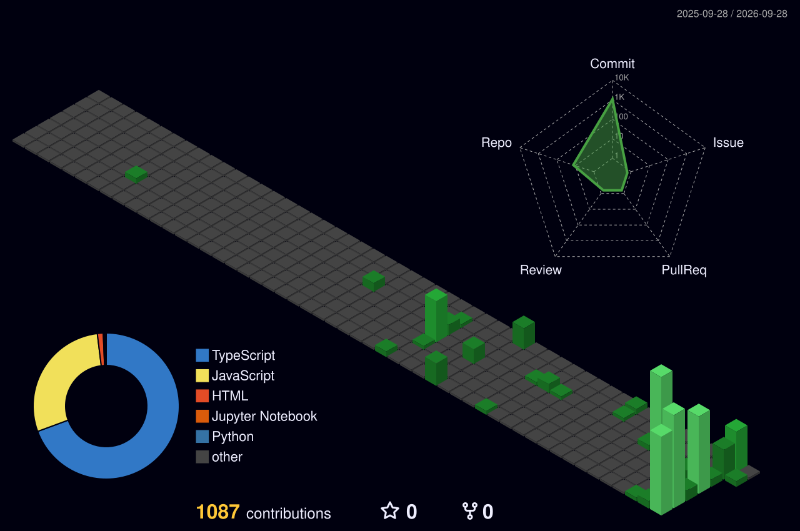
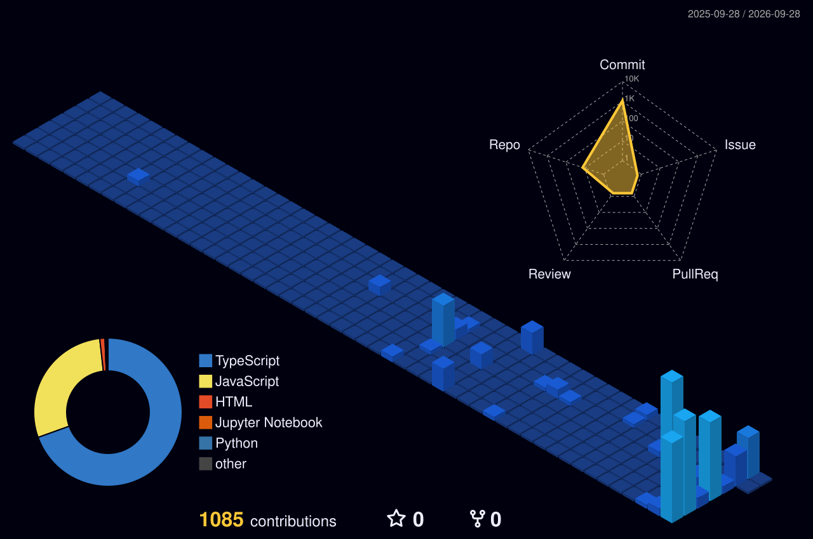
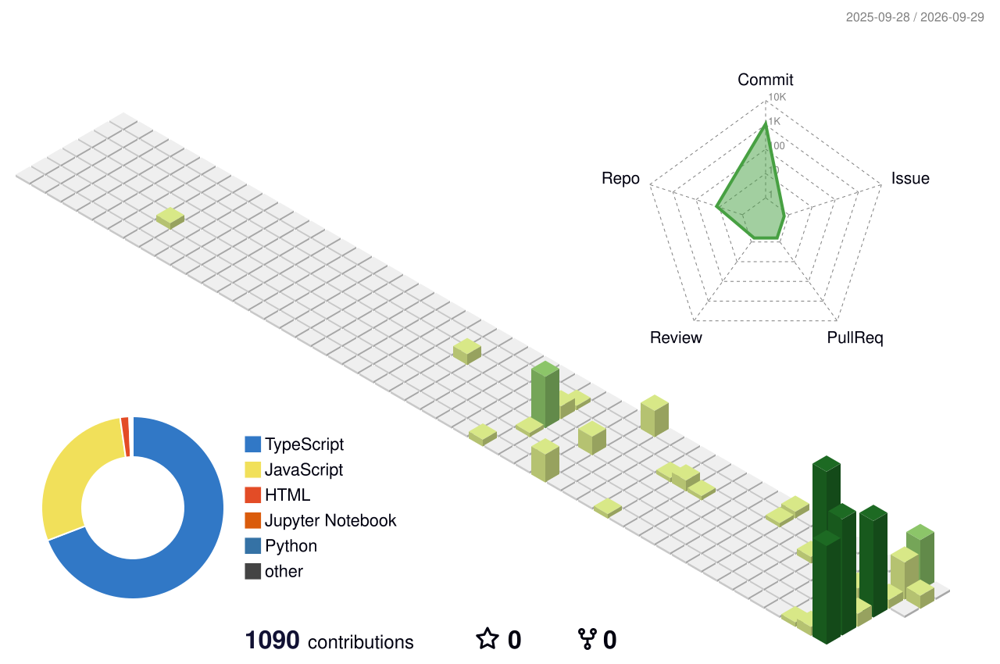
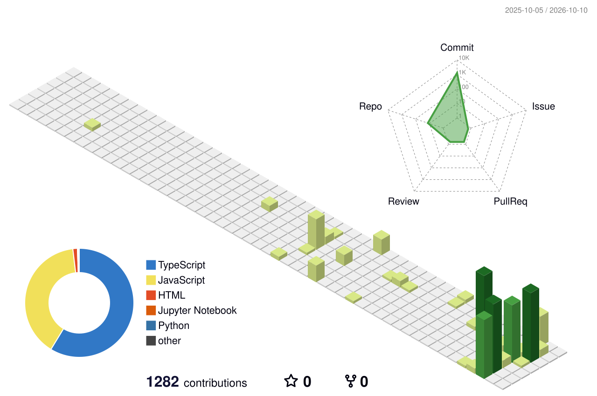
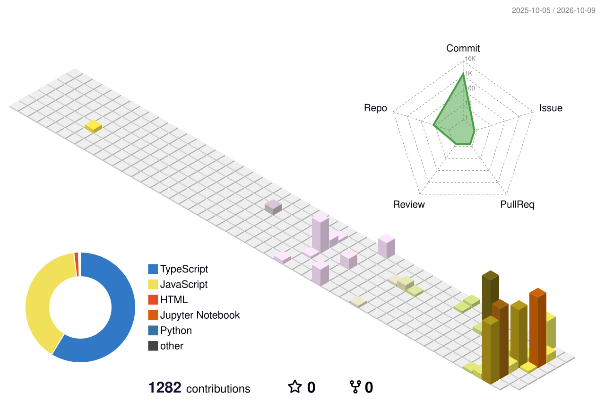
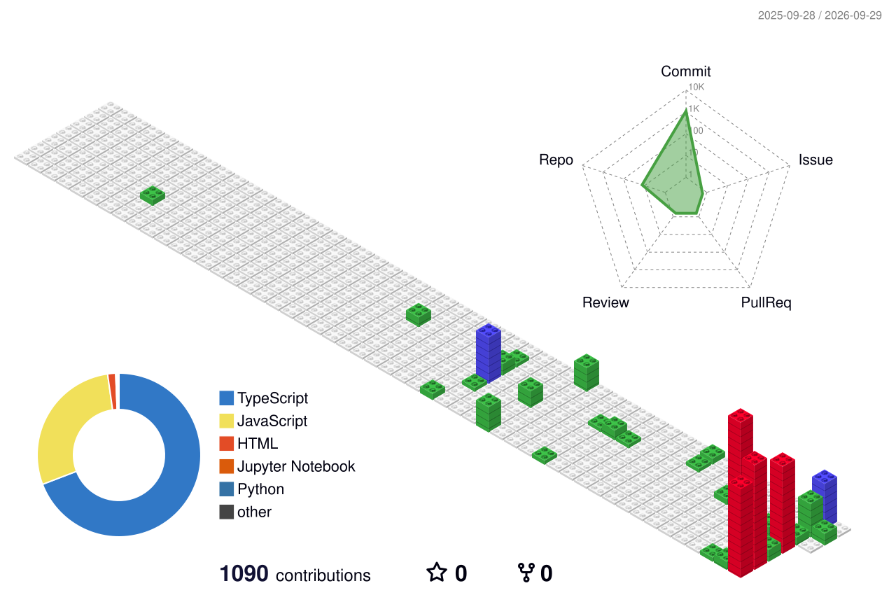
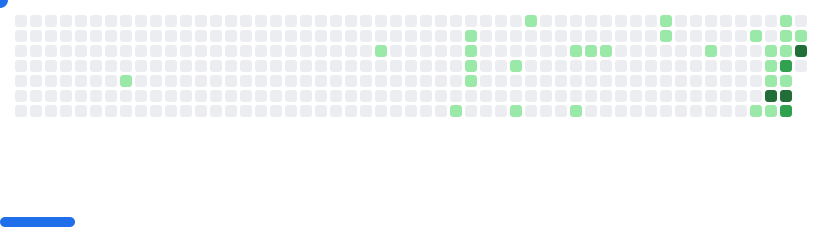

<!-- ═══════════════════════════════════════════════════════════════════════ -->
<!--                              HERO HEADER                                -->
<!-- ═══════════════════════════════════════════════════════════════════════ -->

  

<h3 align="center">
  ⚡ Builder &nbsp;•&nbsp; 💻 Full-Stack Engineer &nbsp;•&nbsp; 🤖 AI Systems Architect &nbsp;•&nbsp; 🎨 Product Designer
</h3>

  <strong>Turning ambitious ideas into scalable products.</strong> 
  I engineer full-stack web applications, autonomous AI systems, and craft polished digital experiences — from Figma frame to production code.

  
  
  
  
  
  

 

  

 

<table align="center">
<tr>
<td align="center" width="180">

### 🚀
**Products** 
**15+ Shipped**

</td>
<td align="center" width="180">

### 💻
**Stack** 
**Full-Stack · Next.js**

</td>
<td align="center" width="180">

### 🤖
**Systems** 
**AI × SaaS × Web3**

</td>
<td align="center" width="180">

### 🎨
**Design** 
**Figma → Code**

</td>
</tr>
</table>

 

  
  
  

 

  <i>"Pain builds. Power remains. Beyond strength, beyond limits, beyond you."</i>

---

<!-- ═══════════════════════════════════════════════════════════════════════ -->
<!--                              ABOUT ME                                   -->
<!-- ═══════════════════════════════════════════════════════════════════════ -->

## 🚀 About Me

I'm a **Full-Stack Developer, AI Systems Architect, and Product Designer** — I own the entire spectrum from initial concept to deployed production system.

I work across **engineering** (APIs, databases, cloud, AI agents) and **design** (systems, motion, visual identity, UX architecture) — treating both as equal crafts that serve the same mission:

**Build things that are technically bulletproof, visually unforgettable, and genuinely useful.**

---

<!-- ═══════════════════════════════════════════════════════════════════════ -->
<!--                    LIVE GITHUB METRICS (auto-generated SVG)             -->
<!-- ═══════════════════════════════════════════════════════════════════════ -->

# 📊 GitHub Statistics

> Auto-generated every 6 hours directly from GitHub API via PAT — always your real data.

  

<table align="center" width="100%">
<tr>
  <td width="50%">
    
  </td>
  <td width="50%">
    
  </td>
</tr>
<tr>
  <td width="50%">
    
  </td>
  <td width="50%">
    
  </td>
</tr>
</table>

---

<!-- ═══════════════════════════════════════════════════════════════════════ -->
<!--                         LIVE STREAK STATS                               -->
<!-- ═══════════════════════════════════════════════════════════════════════ -->

# 🔥 Contribution Streak

  

---

<!-- ═══════════════════════════════════════════════════════════════════════ -->
<!--                       3D CONTRIBUTION SKYLINE                           -->
<!-- ═══════════════════════════════════════════════════════════════════════ -->

# 🌃 3D Contribution Skyline

  

🎨 Other 3D Skyline Themes

### 🌙 Night Green

---

### 🌆 Night View

---

### 🌿 Green

---

### ✨ Animated Green

---

### 🍂 Season

---

### 🧱 GitBlock

 

---

<!-- ═══════════════════════════════════════════════════════════════════════ -->
<!--                           GITHUB BREAKOUT                               -->
<!-- ═══════════════════════════════════════════════════════════════════════ -->

# 🎮 GitHub Breakout — Playable Game

<picture>
  <source media="(prefers-color-scheme: dark)" srcset="./images/breakout-dark.svg">
  
</picture>

---

<!-- ═══════════════════════════════════════════════════════════════════════ -->
<!--                       SNAKE CONTRIBUTION GRID                           -->
<!-- ═══════════════════════════════════════════════════════════════════════ -->

# 🐍 Contribution Snake

<picture>
  <source media="(prefers-color-scheme: dark)" srcset="https://raw.githubusercontent.com/bhasitgupta/bhasitgupta/output/github-contribution-grid-snake-dark.svg">
  
</picture>

---

<!-- ═══════════════════════════════════════════════════════════════════════ -->
<!--                         WHAT I BUILD & DESIGN                           -->
<!-- ═══════════════════════════════════════════════════════════════════════ -->

# ⚡ What I Build & Design

<table align="center" width="100%">
<tr>
<td align="center" valign="top" width="50%">

## 💻 Engineering

**Full-Stack Web Systems**
Scalable Next.js apps, REST & real-time APIs, Supabase/PostgreSQL, cloud deployments, CI/CD pipelines

**AI & Autonomous Systems**
LLM-powered agents, agentic workflows, OpenAI integrations, neural pipeline engineering

**Web3 & Blockchain**
Smart contracts (Solidity), Stellar/Soroban DeFi apps, IPFS storage, WalletConnect integration

**Developer Tooling**
Discord bots, automation with n8n, SaaS dashboards, music bots, monitoring platforms

</td>
<td align="center" valign="top" width="50%">

## 🎨 Design & Craft

**UI/UX Architecture**
Design systems, component libraries, wireframes, high-fidelity Figma prototypes

**Visual Identity**
Brand identities, logo design, typography systems, color theory, graphic design

**Motion & Animation**
After Effects motion graphics, CSS micro-interactions, SVG animations, scroll-triggered UX

**Product Design**
Concept to pixel-perfect implementation — I design and build my own products end-to-end

</td>
</tr>
</table>

---

<!-- ═══════════════════════════════════════════════════════════════════════ -->
<!--                              TECH ARSENAL                               -->
<!-- ═══════════════════════════════════════════════════════════════════════ -->

# 💻 Tech Arsenal

## 🎨 Design & Motion

 

---

## 🌐 Frontend Engineering

---

## ⚙️ Backend & Systems

---

## 🗄️ Databases & Storage

---

## 🤖 AI / Machine Learning

---

## ⛓️ Blockchain & Web3

---

## ☁️ Cloud, DevOps & CI/CD

---

## 🛠️ Dev Tools & Productivity

---

## 🖥️ Languages

---

<!-- ═══════════════════════════════════════════════════════════════════════ -->
<!--                         CONNECT WITH ME                                 -->
<!-- ═══════════════════════════════════════════════════════════════════════ -->

# 🌐 Connect

&nbsp;

&nbsp;

&nbsp;

&nbsp;

 

  

*"Pain builds. Power remains. Beyond strength, beyond limits, beyond you."*

⭐ **Star some repos if you like what you see!**

