<!-- ======================================================================= -->
<!--                             HERO BANNER                                 -->
<!-- ======================================================================= -->

  

<!-- ======================================================================= -->
<!--                           TYPING ANIMATION                              -->
<!-- ======================================================================= -->

  

<!-- ======================================================================= -->
<!--                            SOCIAL BADGES                                -->
<!-- ======================================================================= -->

  
  
  
  
  
  

<!-- ======================================================================= -->
<!--                         TELEMETRY COUNTERS                              -->
<!-- ======================================================================= -->

  
  
  

  <i>"The best software lives at the exact convergence of ruthless engineering, obsessive design, and autonomous AI."</i>

---

<!-- ======================================================================= -->
<!--                       CORE PILLARS OF MASTERY                           -->
<!-- ======================================================================= -->

## ⚡ Core Disciplines & Focus

<table align="center" width="100%">
<tr>
<td align="center" width="25%" style="padding: 16px;">

### 🏛️
**Full-Stack Architecture**
 
Microservices • Distributed Systems • Clean Architecture • Next-Gen APIs

</td>
<td align="center" width="25%" style="padding: 16px;">

### 🎨
**Design & Motion**
 
UI/UX Architecture • Design Systems • Micro-Interactions • Motion Design

</td>
<td align="center" width="25%" style="padding: 16px;">

### 🤖
**AI & Autonomous Systems**
 
Agentic Workflows • Neural Pipelines • LLM Orchestration • AI Interfaces

</td>
<td align="center" width="25%" style="padding: 16px;">

### ⚡
**Design to Product**
 
Concept to Scaled Code • Production Velocity • Zero Aesthetic Compromise

</td>
</tr>
</table>

---

<!-- ======================================================================= -->
<!--                         3D SKYLINE CONTRIBUTION                         -->
<!-- ======================================================================= -->

## 🌃 3D Contribution Skyline

  

<b>🎨 Explore Alternate 3D Skyline Themes</b>

 

### 🌙 Night View

  

---

### 🌿 Night Green

  

---

### 🧱 GitBlock 3D

  

---

### 🍂 Season 3D

  

---

<!-- ======================================================================= -->
<!--                       SNAKE CONTRIBUTION GRID                           -->
<!-- ======================================================================= -->

## 🐍 Contribution Snake Matrix

<picture>
  <source media="(prefers-color-scheme: dark)" srcset="https://raw.githubusercontent.com/bhasitgupta/bhasitgupta/output/github-contribution-grid-snake.svg?v=2">
  <source media="(prefers-color-scheme: light)" srcset="https://raw.githubusercontent.com/bhasitgupta/bhasitgupta/output/github-contribution-grid-snake.svg?v=2">
  
</picture>

---

<!-- ======================================================================= -->
<!--                       CYBERPUNK SUMMARY CARD                            -->
<!-- ======================================================================= -->

## 🧊 Profile Architecture Telemetry

---

<!-- ======================================================================= -->
<!--                           GITHUB STATS                                  -->
<!-- ======================================================================= -->

## 📊 Performance & Commit Telemetry

---

<!-- ======================================================================= -->
<!--                           TECH ARSENAL                                  -->
<!-- ======================================================================= -->

# 💻 Tech Arsenal & Creative Toolchain

### 🎨 UI/UX, Graphic & Motion Design

  

  
  
  

---

### 🌐 Frontend & Client Architecture

  

---

### ⚙️ Backend, Systems & Cloud Infrastructure

  

---

### 🤖 AI, Neural Workflows & Agentic Systems

  
  
  
  
  

---

### 🛠️ Developer Tools & Environments

  

 

---

<!-- ======================================================================= -->
<!--                         INTERACTIVE CONNECT                             -->
<!-- ======================================================================= -->

## 🌐 Connect & Collaborate

  
  &nbsp;&nbsp;
  
  &nbsp;&nbsp;
  
  &nbsp;&nbsp;
  
  &nbsp;&nbsp;
  

 

<!-- ======================================================================= -->
<!--                           SIGNATURE FOOTER                              -->
<!-- ======================================================================= -->

  

*"Every line of code is an architectural decision; every pixel is an emotional impression."*

 

⭐ **Star repositories to support open engineering!**

