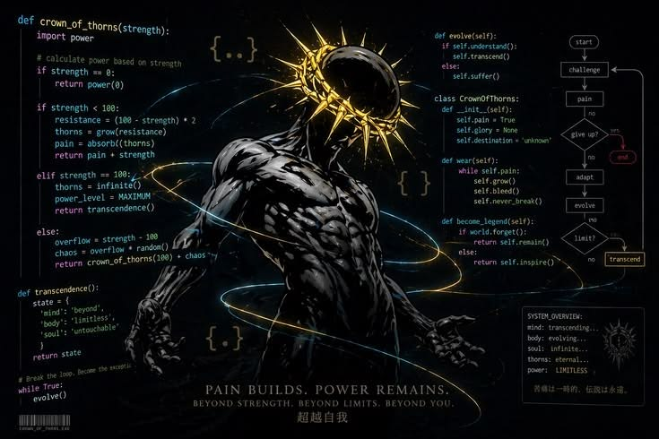
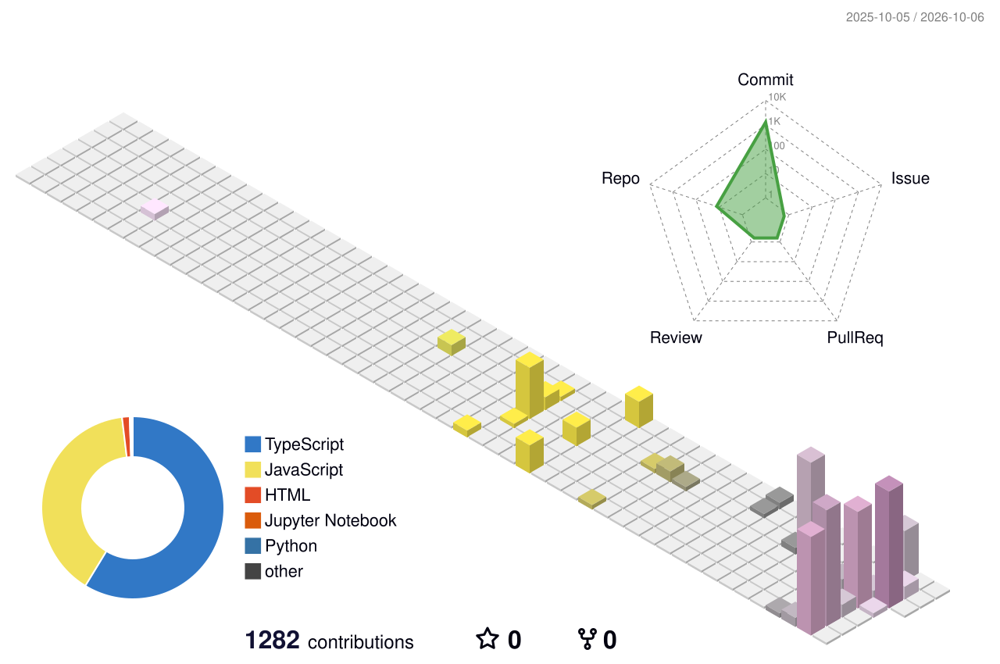

<!-- ═══════════════════════════════════════════════════════════════════════ -->
<!--                              HERO HEADER                                -->
<!-- ═══════════════════════════════════════════════════════════════════════ -->

  

<h3 align="center">
  ⚡ Builder &nbsp;•&nbsp; 💻 Full-Stack Engineer &nbsp;•&nbsp; 🤖 AI Systems Architect &nbsp;•&nbsp; 🎨 Product Maker
</h3>

  <strong>Turning ambitious ideas into scalable products.</strong> 
  I design, engineer, and ship high-impact full-stack web applications, autonomous AI systems, and polished digital experiences.

  
  
  
  
  

 

  

 

<table align="center">
<tr>
<td align="center" width="180">

### 🚀
**Products** 
**15+ Built & Shipped**

</td>
<td align="center" width="180">

### ⚡
**Stack** 
**Full-Stack & Next.js**

</td>
<td align="center" width="180">

### 🤖
**Focus** 
**AI Systems × SaaS**

</td>
<td align="center" width="180">

### 🎨
**Craft** 
**Code × Design**

</td>
</tr>
</table>

 

  
  
  

 

  <i>"Pain builds. Power remains. Beyond strength, beyond limits, beyond you."</i>

<!-- ═══════════════════════════════════════════════════════════════════════ -->
<!--                              ABOUT ME                                   -->
<!-- ═══════════════════════════════════════════════════════════════════════ -->

## 🚀 About Me

I'm a **Full-Stack Developer, AI Systems Architect & Product Builder** focused on turning ideas into scalable, high-performance products.

I engineer across the entire stack — from **design systems, micro-interactions, and reactive interfaces** to **robust backend APIs, real-time databases, AI agents, and cloud infrastructure**.

My goal is simple:

**Build software that is technically rock-solid, visually exceptional, and genuinely impactful.**

---

<!-- ═══════════════════════════════════════════════════════════════════════ -->
<!--                       3D CONTRIBUTION SKYLINE                           -->
<!-- ═══════════════════════════════════════════════════════════════════════ -->

# 🌃 3D Contribution Skyline

  

🎨 Other Themes

### 🌙 Night Green

---

### 🌆 Night View

---

### 🌿 Green

---

### ✨ Animated Green

---

### 🍂 Season

---

### 🧱 GitBlock

---

### ⚪ South Season

 

---

<!-- ═══════════════════════════════════════════════════════════════════════ -->
<!--                           GITHUB BREAKOUT                               -->
<!-- ═══════════════════════════════════════════════════════════════════════ -->

# 🎮 GitHub Breakout

<picture>
  <source media="(prefers-color-scheme: dark)" srcset="./images/breakout-dark.svg">
  
</picture>

---

<!-- ═══════════════════════════════════════════════════════════════════════ -->
<!--                       SNAKE CONTRIBUTION GRID                           -->
<!-- ═══════════════════════════════════════════════════════════════════════ -->

# 🐍 Contribution Snake

<picture>
  <source media="(prefers-color-scheme: dark)" srcset="https://raw.githubusercontent.com/bhasitgupta/bhasitgupta/output/github-contribution-grid-snake-dark.svg">
  
</picture>

---

<!-- ═══════════════════════════════════════════════════════════════════════ -->
<!--                         GITHUB STATISTICS                               -->
<!-- ═══════════════════════════════════════════════════════════════════════ -->

# 📊 GitHub Statistics

  
  &nbsp;
  

  

---

<!-- ═══════════════════════════════════════════════════════════════════════ -->
<!--                              TECH STACK                                 -->
<!-- ═══════════════════════════════════════════════════════════════════════ -->

# 💻 Tech Stack

## 🎨 Design & Prototyping

---

## 🌐 Frontend Development

---

## ⚙️ Backend Development

---

## 🗄️ Databases & Storage

---

## 🤖 AI / Machine Learning

---

## ⛓️ Blockchain & Web3

---

## ☁️ Cloud & DevOps

---

## 🛠️ Development & Productivity Tools

---

## ⚡ Automation & Workflows

---

## 🖥️ Programming Languages

---

<!-- ═══════════════════════════════════════════════════════════════════════ -->
<!--                         CONNECT WITH ME                                 -->
<!-- ═══════════════════════════════════════════════════════════════════════ -->

# 🌐 Connect With Me

&nbsp;

&nbsp;

&nbsp;

 

<!-- ═══════════════════════════════════════════════════════════════════════ -->
<!--                           SIGNATURE FOOTER                              -->
<!-- ═══════════════════════════════════════════════════════════════════════ -->

  

  

*"Pain builds. Power remains. Beyond strength, beyond limits, beyond you."*

 

⭐ **Star some repos if you like what you see!**

